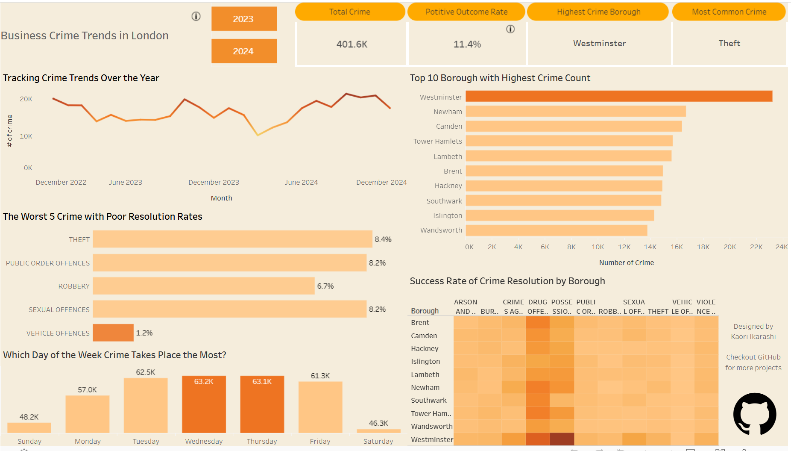

 

# London Business Crime Analysis 


### Navigation

* [Summary](#summary) 
* [Project Structure](#project-structure)
* [Tools & Techniques](#tools--techniques)
* [Data Cleaning & Preparation](#data-cleaning--preparation)
* [Exploratory Analysis Highlights](#exploratory-analysis-highlights)
* [Modelling Approach](#modelling-approach)
* [Dashboard](#dashboard)|
* [Final Insights](#final-insights)
* [For Recruiters](#for-recruiters)
* [How to Run](#how-to-run)
* [Reflection](#reflection)
* [Links](#links)


**London Business Crime Analysis** is a full end‑to‑end data analytics project using 41k+ London business crime records. This project demonstrates practical skills across data cleaning, EDA, feature engineering, modelling, and dashboarding.


## Summary

Dataset size: 41,585 rows\
Tools: Python (pandas, numpy, matplotlib, seaborn, plotly, scikit‑learn, SciPy), Tableau

**Key Findings**

* Business crime **increased 3.7%** from 2023 → 2024.

* Positive outcome rate **fell by 0.4 percentage points**.

* **Westminster** consistently recorded the highest volume of crime.

* **Theft** was the most common crime type with one of the lowest positive outcome rates.

* Crime peaked **mid‑week (Wed/Thu)**.
<br><br>

**Deliverables**

* Cleaned, sampled, and engineered dataset.

* Exploratory visualisations and statistical analysis.

* Regression‑based crime trend model.

* Interactive Tableau dashboard with borough/year filters and KPI tiles.


## Project Structure
```
project/
│── data/
│ ├── data_cleaned.csv/
│ ├── online_datasource.md/
│ ├── raw_data.csv
│ └── sample_data.csv
│── images/
│── jupyter_notebooks/
│ ├── etl_pipeline.ipynb
│ ├── exploratory_data_analysis.ipynb
│ └── statistical_analysis.ipynb
│── README.md
│── requirements.txt

```

## Tools & Techniques

**Python**: pandas, numpy, matplotlib, seaborn, plotly

**Modelling**: scikit‑learn (regression), SciPy (statistical tests)

**Visualisation**: Tableau (interactive dashboard)

**Workflow**: modular notebook + scripts; reproducible environment

## Data Cleaning & Preparation

* Removed duplicates, nulls, and inconsistent records.

* Standardised categorical fields (crime type, borough).

* Sampled ~10% of high‑volume monthly data for exploratory analysis.

* Engineered new features for time‑based and borough‑level analysis.

## Exploratory Analysis Highlights

* Identified boroughs with rapidly rising crime trends.

* Compared crime volumes by month, weekday, and outcome categories.

* Highlighted crime types with low outcome rates but high frequency (notably theft).

* Performed weekday pattern analysis showing mid‑week spikes.

## Modelling Approach

Built a regression model to predict crime volume and test core hypotheses:

1. Are crime volumes trending upward overall?

2. Do certain boroughs show more volatility?

3. Are weekday effects statistically significant?

Evaluated model fit using R² and compared performance to baseline time‑trend assumptions.

## Dashboard

An interactive Tableau dashboard allows users to:

* Filter by **year** and **borough**

* Track KPIs: crime volume, outcome rate, borough comparisons

* Explore distribution of crime types and trends

 

## Final Insights

Crime is rising YoY, indicating growing pressure on business safety.

Outcome rates are deteriorating slightly, suggesting resource or process gaps.

Westminster remains a persistent hotspot requiring targeted intervention.

Theft deserves focused attention due to both volume and poor outcomes.

Operational planning could benefit from mid‑week resourcing adjustments.

## For Recruiters

This project demonstrates: 

The ability to take **raw data** → **insights** → **model** → **dashboard**.

Skills in cleaning, aggregating, analysing, and visualising real‑world data.

Clear business thinking around crime trends, operational performance, and resource allocation.

A professional, reproducible workflow.

## How to Run

1. Clone the repo.

2. Install dependencies:
```
 pip install -r requirements.txt
```
3. Run the Jupyter notebook in this order:
```
 jupyter_notebooks/

 etl_pipeline.ipynb
 exploratory_data_analysis.ipynb
 statistical_analysis.ipynb

```
4. Use the exported `data_cleaned.csv` for further visualisation in Tableau or other BI tools.

## Reflection

* Organising the workflow into clear modules (cleaning, EDA, modelling, dashboards) made the project easier to follow and maintain, reflecting how real analytics pipelines are structured.

* Handling a dataset originally over 400k rows required efficient techniques such as sampling, aggregation, and datatype optimisation to maintain performance without losing meaningful patterns.

* Designing the dashboard reinforced the importance of pairing high‑level KPIs with detailed breakdowns, ensuring both strategic stakeholders and operational teams can quickly access the insights they need.

## Links

Dashboard: [Tableau Link](https://public.tableau.com/views/LondonBusinessCrimeAnalysis/Dashboard1?:language=en-GB&:sid=&:redirect=auth&:display_count=n&:origin=viz_share_link)

Dataset Source: [London Datastore](https://data.london.gov.uk/dataset/mps-business-crime-dashboard-data/)
<br><br>

Feel free to reach out with questions or suggestions!


[Back to top 🔝](#top)

