 

# London Business Crime Analysis 

### Navigation
* [README](https://github.com/Kaori61/crime-data-analysis/blob/main/README.md)
* [Clean data](https://github.com/Kaori61/crime-data-analysis/blob/main/dataset/data_cleaned.csv)
* [Raw data](https://github.com/Kaori61/crime-data-analysis/blob/main/dataset/raw_data.csv)
* [Exploratory data analysis (EDA)](https://github.com/Kaori61/crime-data-analysis/blob/main/jupyter_notebooks/exploratory_data_analysis.ipynb)
* [Statistical analysis](https://github.com/Kaori61/crime-data-analysis/blob/main/jupyter_notebooks/statistical_analysis.ipynb)
* [Dashboard](https://public.tableau.com/views/LondonBusinessCrimeAnalysis/Dashboard1?:language=en-GB&:sid=&:redirect=auth&:display_count=n&:origin=viz_share_link)

**London Business Crime Analysis** is a personal capstone project focused on the ETL (Extract, Transform, Load) pipeline, exploratory data analysis and statistical analysis in Jupyter Notebook and visualisations in Tableau. 

The project examines business-related crimes (any criminal offence committed against a person or property associated with the connection of that person or property to a business) across London boroughs, using publicly available police data. This analysis aims to uncover trends in types of crimes, identify crime rates in different boroughs and generate insights to inform better resource allocation, operational improvement and prediction of seasonal trends.

## Dataset Content
* The London Business Crime dataset is publicly available data that can be downloaded from here [London Datastore](https://data.london.gov.uk/dataset/mps-business-crime-dashboard-data/). The data contains the last 2 years of a range of crimes, such as date, borough, type of crime and more.

## Business Requirements
* Monitor borough performance.
* Identify crime types that need attention.
* Improve case closure rate.
* Identify which day of the week experiences the highest levels of crime.

## Hypothesis and how to validate?
### 1. Certain crimes have a higher positive outcome rate than others.

How to prove it? - Compare positive outcome rates. 

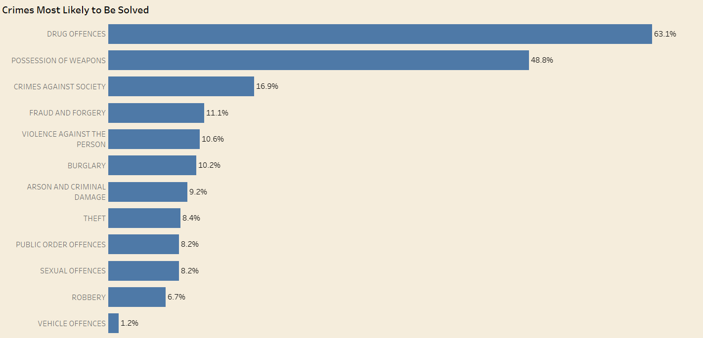 

The positive outcome refers to crimes that was handled successfully such as offender was charged, fined, cautioned or held accountable.\
*The graph shows a significant difference between the highest positive outcome rate (Drug Offences – 63.1%) and the lowest (Vehicle Offences – 1.2%). This supports the hypothesis that positive outcome rates vary across different types of crime.*

### 2. The number of crimes is decreasing over time.

How to prove it? - Line chart of monthly crime cases.\
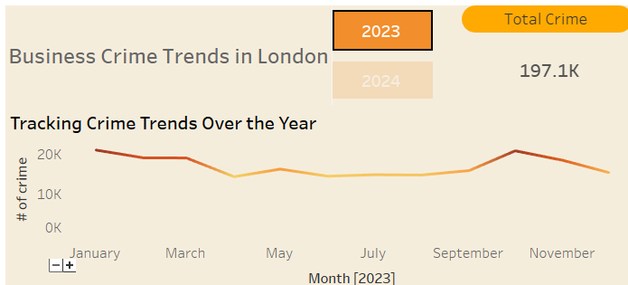\
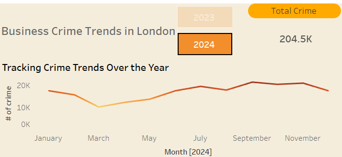\
*On the top right-hand side in Total Crime KPI, those visualisations show the total number of crimes yearly. The visualisation disproves that the number of crimes is decreasing over time*

### 3. Crime frequency is significantly higher on weekdays and during the winter months.

How to prove it? - Create a visualisation to show the distribution of crimes on weekdays and by month.

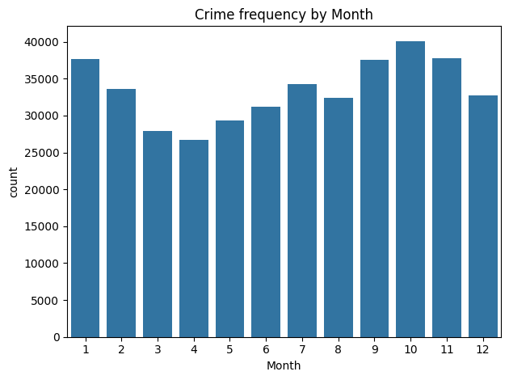 
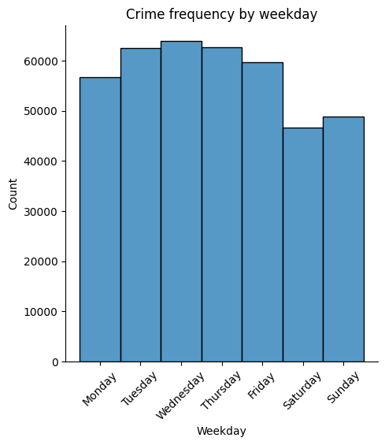

*The visualisation proves that more crimes take place on weekdays and during the winter months*

### 4. The types of common crime differ across boroughs.
    
How to prove it? - Visualise types of crime by boroughs.

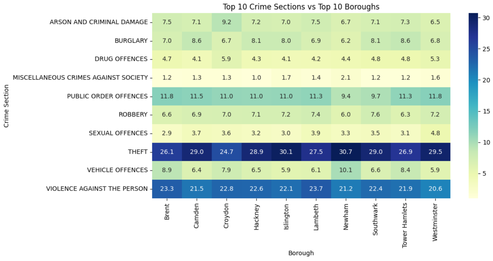
    
  *The visualisation disproves the hypothesis. While minor variations exist between boroughs, Theft consistently emerges as the most common type of crime across all areas.* 

## Project Plan
### High-level steps taken for the analysis.
* Data collection
* Data cleaning & transformation
* Exploratory data analysis (EDA)
* Statistical analysis
* Dashboard creation
* Insight generation

### Data management 
How was the data managed throughout the collection, processing, analysis and interpretation steps?
* Original data was kept as `raw_data.csv` as a reference.
* Data processing and calculation were done in Python and Tableau.
* Key metrics were visualised during interpretation using bar charts, heatmaps and KPI.

### Rationale for research methodologies
- Data cleaning & transformation: This is a key preparation before performing any analysis for data integrity and reliability.
- EDA: I performed EDA to understand the data structure and patterns better and generate meaningful insights from the analysis.
- Statistical analysis: Create a regression model to predict the future trend
- Dashboard creation: Visualisation is to show key metrics and findings to the stakeholders

## The rationale to map the business requirements to the Data Visualisations
* Monitor borough performance.\
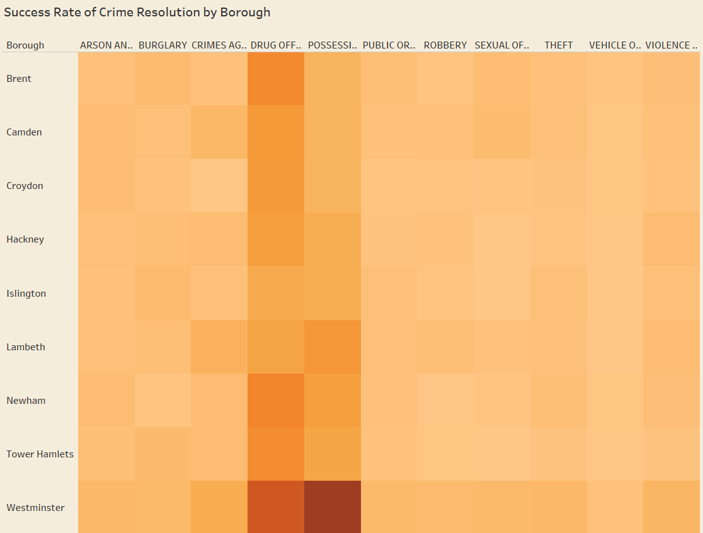\
*A heatmap can show the demographic of crime rates all at once, so I decided to use this graph. \
Darker orange represents crimes with high resolution rates for specific crimes in different boroughs.* 

* Identify the crime type that needs attention.\
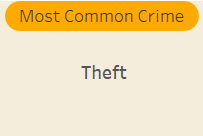\
*The most common crime doesn't change over time based on the analysis I performed; therefore, I decided to put the results as a KPI*

* Improve case closure rate.\
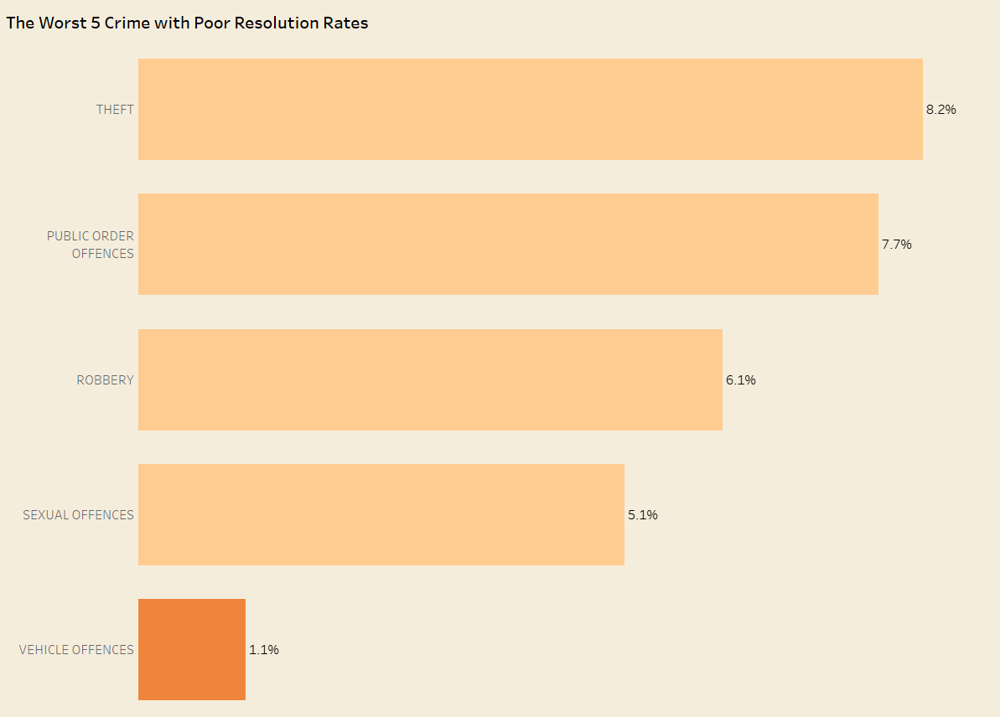\
*This is the list of crimes with the bottom 5 worst closure rates that need to improve.\
There are 12 different crime types, but I wanted the audience to focus on the least ones, so I made a bar chart with the worst 5*

* Identify the day of the week that experiences the highest crime levels.\
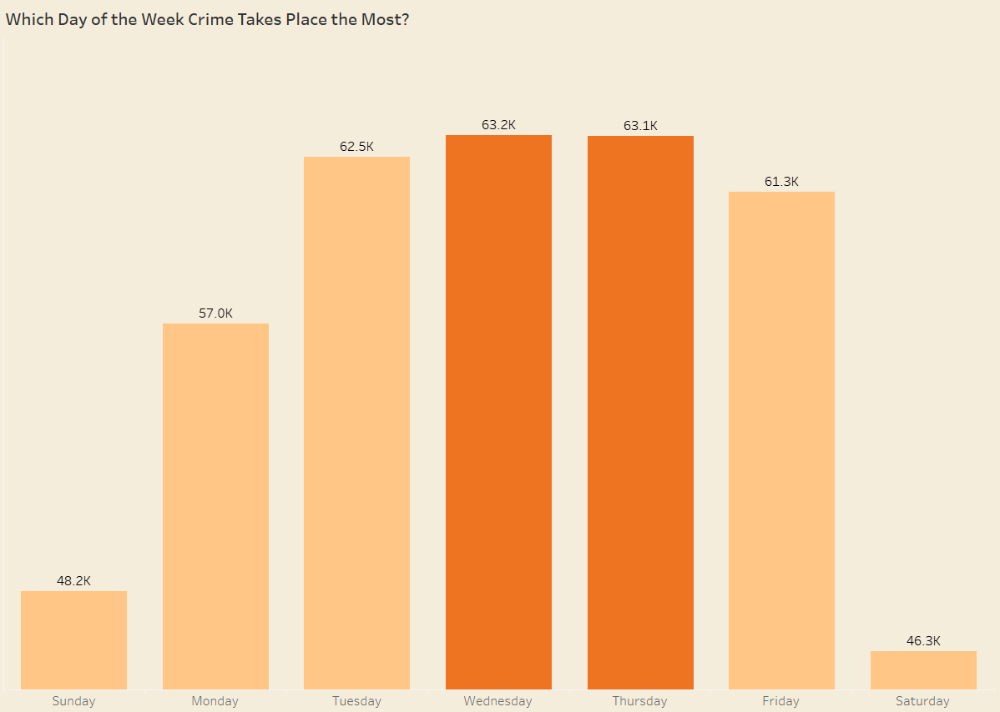\
*This was an interesting finding in addition to the original business requirements. This could be used to guide effective resource allocation, improve operational planning and target interventions.*

## Analysis techniques used
### Data analysis methods used
- Data cleaning and transformation: The Data contains over 400k rows, causing issues, so I sampled the data to 10% of the original data. Replaced null values with appropriate values. Converted some of the data types into proper data types. Checked for errors and typos in the variables. Created new columns for analysis.  
- Exploratory data analysis: Used to understand crime distributions by type, borough and time.
- Statistical analysis: Aggregate data and create a statistical comparison to understand if the difference in positive outcome rate is statistically significant in different locations. Created a regression model to predict the crime trend.  

### Limitations
* The data contains primarily categorical data, which was problematic for statistical analysis. I performed feature engineering on the data for them to be able to make statistical calculations with the help of generative AI. I also had problems manipulating some data in Tableau, as it wasn't numerical data.
- I wanted to create a map of the London Borough that shows the different crime rates in Tableau. However, Tableau doesn't contain the London borough spatial data by default. I tried to install it in Tableau, but it wasn't successful. Instead, I created a heatmap to show the demographic of crime rates in different locations.

### Generative AI
- I used generative AI to plan a project, brainstorm ideas, and aid in code generation and optimisation.

## Ethical considerations
* This project uses anonymised, publicly available data with no personally identifiable information. Ethical considerations regarding privacy and confidentiality have been fully observed.

## Dashboard Design
### Access to my dashboard from here: [Business Crime Trends in London](https://public.tableau.com/views/LondonBusinessCrimeAnalysis/Dashboard1?:language=en-GB&:sid=&:redirect=auth&:display_count=n&:origin=viz_share_link)
### Overview of dashboard
I wanted to use a consistent colour scheme to make the information easy to digest. I used a highlighter to emphasise the focus point on each graph.

### Filter 
The graphs and KPIs show the corresponding result when the viewer selects the year. As a default, the dashboard shows overall results between 2023 and 2024.

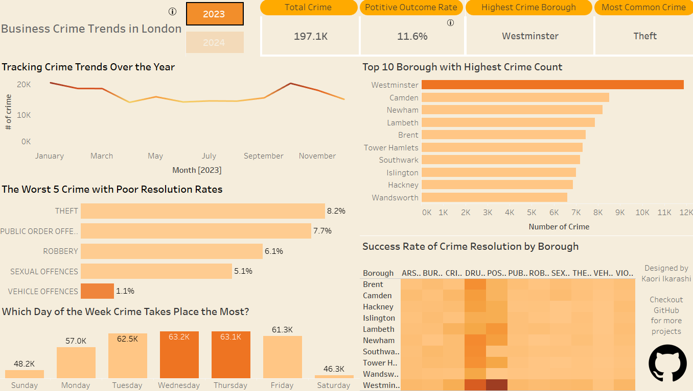 

Similarly to the filter above, graphs and KPI change accordingly when the viewer selects the borough.

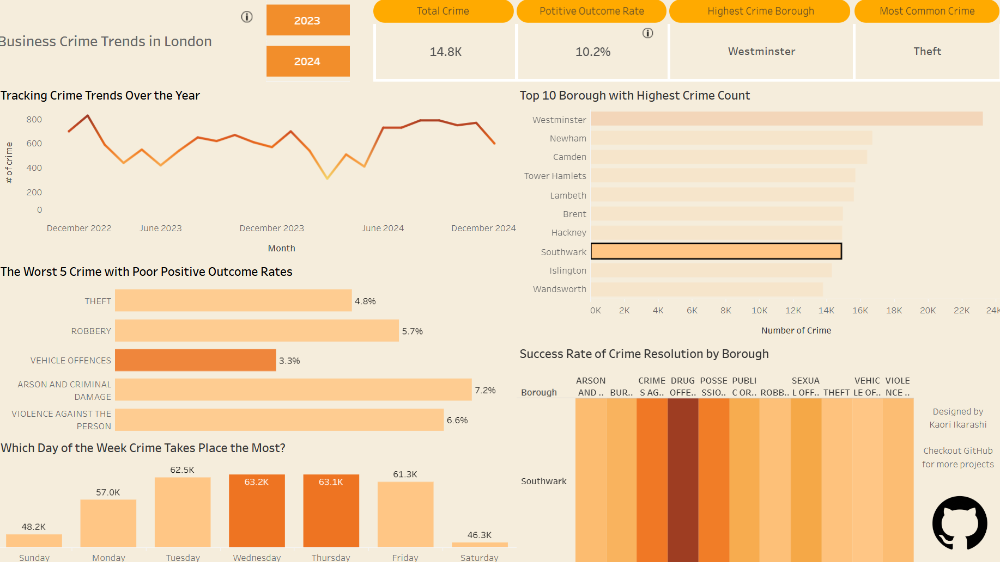

 
### Information button
Business crime and positive outcomes can be misleading, so I created an information button that describes what they mean for accessibility. When the audience hovers over the info icon, it'll show the meaning of those terms. git 
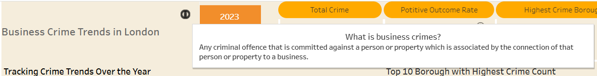
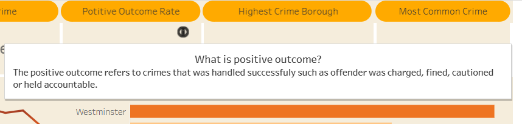

## Unfixed Bugs
* As mentioned in the 'Limitations' section, the dataset primarily consists of categorical variables. I aimed to display the percentage of crime outcomes in each tooltip, but some tooltips did not show the correct values. I attempted to recreate the logic and sought help from generative AI tools; however, I could not find a reliable solution. I suspect the issue stems from how I transformed and aggregated the categorical data before visualising it. Despite various attempts, I could not resolve the inconsistency in how percentages were calculated and displayed.

## Development Roadmap
* I had issues activating my Python virtual environment (`.venv`) in Git Bash while using the default MINGW64 shell — VS Code wasn't detecting the environment, and key packages like `pandas` weren't working. After some changes to `.bashrc`, Git Bash began launching in the MSYS shell, which added confusion by showing duplicate prompts like (`.venv`) (`.venv`).
With help from ChatGPT, I diagnosed the issue, fixed my .bashrc configuration, selected the correct interpreter in VS Code, and installed missing packages like ipykernel.
* Plotly wasn't working properly on Jupyter Notebook. It kept showing me the error message "nbformat >=4.2.0 isn't installed" even though I installed the correct version. Thanks to two of my fellow students, Celia and Jane, who helped me fix this issue. I was able to create Plotly graphs. 
* I had issues with regression models. The first prediction model didn't include cyclical patterns, so the prediction seemed incorrect. I used ChatGPT to create a better prediction model, incorporate better features, and make predictions with an improved R² value. 
* Raw dataset contains over 400k rows, which caused an error in pushing an update to the repository (I didn't realise the data contained over 400k rows and didn't have a problem pushing commits before changing the same size dataset). Initially, LFS was created to manage data size, but it also created problems. So, I decided to sample data to make the dataset more manageable. 

## Conclusion
* The number of crimes increased by 3.7% from 2023 to 2024, while the positive outcome rate slightly declined by 0.4%. This may indicate a growing demand not being met by available enforcement resources.

* Westminster remains the borough with the highest crime volume in both years. Strengthening security measures in this area could help reduce overall crime figures.

* Theft continues to be the most common crime type, with little change year over year. Notably, theft also appears among the bottom 5 crime types for positive outcome rate, suggesting that this category warrants deeper investigation to identify patterns or trends that could improve resolution rates.

* Drug offences consistently show high positive outcome rates, indicating effective operations. Insights or operational strategies from this area could be adapted or shared to improve performance in lower-performing categories.

* Crime incidents are most concentrated on Wednesdays and Thursdays, suggesting that increased security during midweek may help prevent crimes and better protect business owners.

## Main Data Analysis Libraries
* Pandas - Used this to work with data sorting, filtering, etc
* Numpy - Used this to do calculations with arrays
* Matplotlib - Created basic plots
* Seaborn - Created statistical visualisations like a heatmap
* Plotly - Created interactive charts 
* Scipy - Created statistical analysis
* Scikit-learn - Used this to create a regression model 

## Credits 

* [London crime dataset](https://data.london.gov.uk/dataset/mps-business-crime-dashboard-data/) - Dataset used for analysis.
* [GeekforGeeks](https://www.geeksforgeeks.org/) - Used to aid in code generation.
* [ChatGPT](https://chatgpt.com/) - Used to brainstorm ideas and optimise, generate and debug code.
* [Microsoft Copilot](https://copilot.microsoft.com/chats/wf7sdTkkf6ywDqvFxCqJQ) - Used Copilot built in Visual Studio Code to optimise and debug code.
* [11 Most Favorited Data Visualisations on Tableau Public](https://www.tableau.com/blog/most-favorited-data-visualizations-tableau-public?utm_medium=link&amp;utm_source=Tableau%20Public%20Promo%20Tile) - I got Tableau design inspiration from this article. 
* [Information mark](https://www.vecteezy.com/vector-art/32184554-info-help-sign-icon-vector-symbol-line-outline-art-black-and-white-information-bubble-speech-mark-isolated-pictogram-image) - Information mark in Tableau was taken from this page.

## Acknowledgements 
Everyone I mention here is very quick to respond to my query. I really appreciate their support when I needed it.
* Emma Lamont - Course facilitator at Code Institute. She gave me great support and advice whenever I needed.
* Celia Pires- aka Class Rep. Gave me great assistance to fix my bug in the code. 
* Jane Weightman - aka the Brain. Very knowledgeable and supportive, helped me fix my bug, gave me advice on image creation and inspiration on navigation button.
* Andrei Bitca - aka life saver. Found a last-minute bug, and Andrei was able to point out what was wrong with my code.

